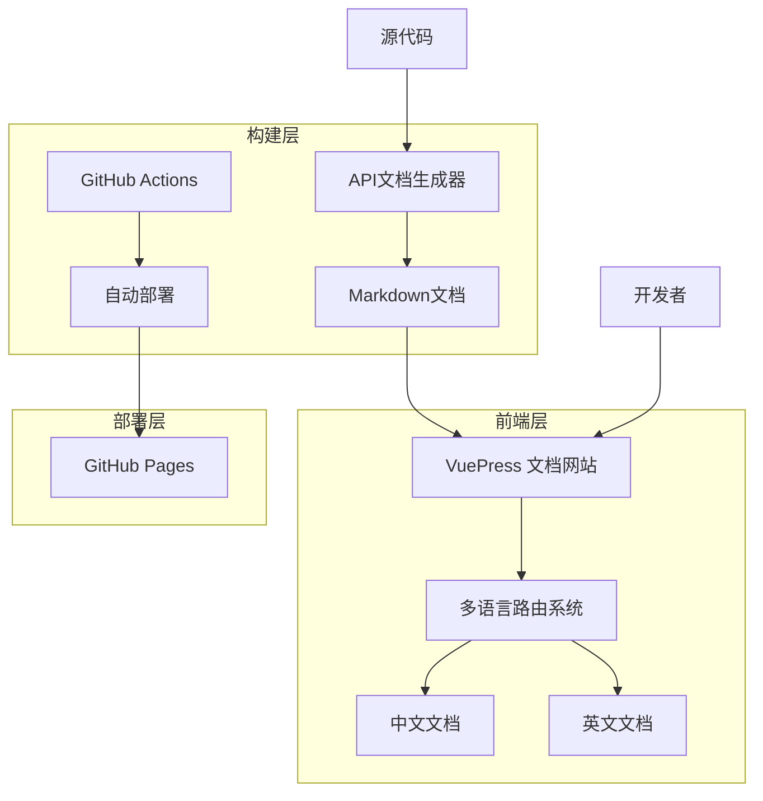
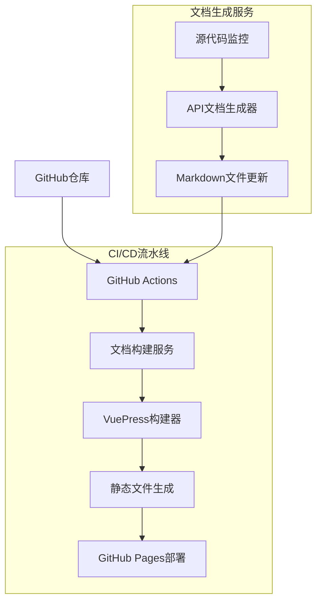
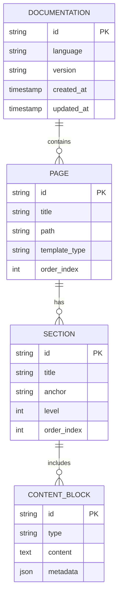

# RWKV Agent Kit 文档重构技术架构文档

## 1. 架构设计



## 2. 技术描述

* 前端: VuePress\@2 + Vue\@3 + TypeScript + Tailwind CSS

* 构建工具: Vite + Node.js 18+

* 部署: GitHub Actions + GitHub Pages

* 文档生成: 自定义Rust文档解析器

## 3. 路由定义

| 路由            | 用途           |
| ------------- | ------------ |
| /             | 首页，项目介绍和快速导航 |
| /zh/          | 中文版本首页       |
| /en/          | 英文版本首页       |
| /zh/guide/    | 中文用户指南       |
| /en/guide/    | 英文用户指南       |
| /zh/api/      | 中文API文档      |
| /en/api/      | 英文API文档      |
| /zh/examples/ | 中文示例代码       |
| /en/examples/ | 英文示例代码       |
| /zh/advanced/ | 中文高级功能       |
| /en/advanced/ | 英文高级功能       |

## 4. API定义

### 4.1 文档生成API

文档自动生成相关接口

```
POST /api/docs/generate
```

请求:

| 参数名          | 参数类型   | 是否必需  | 描述          |
| ------------ | ------ | ----- | ----------- |
| source\_path | string | true  | 源代码路径       |
| output\_path | string | true  | 输出文档路径      |
| language     | string | false | 目标语言(zh/en) |

响应:

| 参数名     | 参数类型      | 描述      |
| ------- | --------- | ------- |
| success | boolean   | 生成是否成功  |
| files   | string\[] | 生成的文件列表 |

示例:

```json
{
  "source_path": "src/",
  "output_path": "docs/api/",
  "language": "zh"
}
```

## 5. 服务器架构图



## 6. 数据模型

### 6.1 数据模型定义



### 6.2 文档目录结构定义

```
-- 创建文档目录结构
docs/
├── .vuepress/
│   ├── config.ts              # VuePress配置文件
│   ├── theme/                 # 自定义主题
│   │   ├── layouts/
│   │   ├── components/
│   │   └── styles/
│   └── public/                # 静态资源
│       ├── images/
│       └── favicon.ico
├── zh/                        # 中文文档
│   ├── README.md              # 中文首页
│   ├── guide/                 # 用户指南
│   │   ├── README.md          # 指南首页
│   │   ├── installation.md    # 安装说明
│   │   ├── quick-start.md     # 快速开始
│   │   └── configuration.md   # 配置说明
│   ├── api/                   # API文档
│   │   ├── README.md          # API首页
│   │   ├── core/              # 核心API
│   │   │   ├── rwkv-agent-kit.md
│   │   │   └── database-manager.md
│   │   ├── agents/            # 智能体API
│   │   │   ├── agent.md
│   │   │   └── memory.md
│   │   └── tools/             # 工具API
│   │       └── tools.md
│   ├── examples/              # 示例代码
│   │   ├── README.md
│   │   ├── basic/
│   │   └── advanced/
│   └── advanced/              # 高级功能
│       ├── README.md
│       ├── custom-agents.md
│       ├── memory-system.md
│       └── tool-development.md
├── en/                        # 英文文档(结构同中文)
│   ├── README.md
│   ├── guide/
│   ├── api/
│   ├── examples/
│   └── advanced/
└── README.md                  # 根目录首页

-- 创建VuePress配置
// .vuepress/config.ts
export default {
  base: '/rwkv-agent-kit/',
  locales: {
    '/': {
      lang: 'zh-CN',
      title: 'RWKV Agent Kit',
      description: '基于RWKV的智能体开发框架'
    },
    '/en/': {
      lang: 'en-US',
      title: 'RWKV Agent Kit',
      description: 'RWKV-based Agent Development Framework'
    }
  },
  themeConfig: {
    locales: {
      '/': {
        navbar: [
          { text: '首页', link: '/' },
          { text: '指南', link: '/guide/' },
          { text: 'API', link: '/api/' },
          { text: '示例', link: '/examples/' }
        ],
        sidebar: {
          '/guide/': [
            {
              text: '用户指南',
              children: [
                '/guide/installation.md',
                '/guide/quick-start.md',
                '/guide/configuration.md'
              ]
            }
          ],
          '/api/': [
            {
              text: '核心API',
              children: [
                '/api/core/rwkv-agent-kit.md',
                '/api/core/database-manager.md'
              ]
            },
            {
              text: '智能体API',
              children: [
                '/api/agents/agent.md',
                '/api/agents/memory.md'
              ]
            }
          ]
        }
      },
      '/en/': {
        navbar: [
          { text: 'Home', link: '/en/' },
          { text: 'Guide', link: '/en/guide/' },
          { text: 'API', link: '/en/api/' },
          { text: 'Examples', link: '/en/examples/' }
        ],
        sidebar: {
          '/en/guide/': [
            {
              text: 'User Guide',
              children: [
                '/en/guide/installation.md',
                '/en/guide/quick-start.md',
                '/en/guide/configuration.md'
              ]
            }
          ]
        }
      }
    }
  }
}

-- 初始化多语言内容
INSERT INTO documentation_structure (path, title_zh, title_en, content_type)
VALUES 
('/guide/installation', '安装说明', 'Installation', 'guide'),
('/api/core/rwkv-agent-kit', 'RwkvAgentKit API', 'RwkvAgentKit API', 'api'),
('/examples/basic/chat', '基础聊天示例', 'Basic Chat Example', 'example');
```

