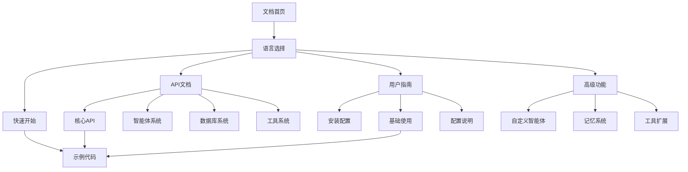

# RWKV Agent Kit 文档重构产品需求文档

## 1. 产品概述

基于RWKV Agent Kit的实际源代码，重新设计和创建完整的中英双语文档系统，提供准确、易用、可维护的API文档和用户指南。

该项目旨在解决现有文档与实际代码不一致的问题，建立标准化的文档架构，支持中英双语，为开发者提供优质的文档体验。

目标是创建一个现代化、专业的文档网站，成为RWKV Agent Kit生态系统的重要组成部分。

## 2. 核心功能

### 2.1 用户角色

| 角色 | 访问方式 | 核心权限 |
|------|----------|----------|
| 开发者 | 直接访问文档网站 | 查看所有API文档、示例代码、使用指南 |
| 贡献者 | GitHub仓库访问 | 编辑文档、提交PR、参与文档维护 |
| 最终用户 | 文档网站浏览 | 查看快速开始、教程、FAQ等用户友好内容 |

### 2.2 功能模块

文档重构项目包含以下主要页面：

1. **首页**: 项目介绍、快速导航、特性展示
2. **API文档**: 完整的API参考文档，基于实际源代码生成
3. **用户指南**: 安装、配置、基础使用教程
4. **高级功能**: 自定义智能体、工具扩展、记忆系统等
5. **示例代码**: 实际可运行的代码示例
6. **多语言切换**: 中英文版本切换功能

### 2.3 页面详情

| 页面名称 | 模块名称 | 功能描述 |
|----------|----------|----------|
| 首页 | 项目介绍 | 展示项目特性、快速开始链接、架构概览 |
| 首页 | 导航菜单 | 提供清晰的文档结构导航，支持中英文切换 |
| API文档 | 核心API | 基于源代码的RwkvAgentKit、DatabaseManager等核心API文档 |
| API文档 | 智能体系统 | Agent、AgentConfig、Memory等智能体相关API |
| API文档 | 数据库系统 | 数据库管理、记忆存储、图谱管理等API |
| API文档 | 工具系统 | Tool trait、工具注册、自定义工具开发API |
| 用户指南 | 安装配置 | 环境要求、依赖安装、基础配置说明 |
| 用户指南 | 快速开始 | 第一个智能体创建、基本对话示例 |
| 用户指南 | 配置说明 | 模型配置、数据库配置、智能体配置详解 |
| 高级功能 | 自定义智能体 | 创建自定义智能体、提示词设计、行为配置 |
| 高级功能 | 记忆系统 | 记忆管理、语义检索、知识图谱使用 |
| 高级功能 | 工具扩展 | 自定义工具开发、工具注册、工具链设计 |
| 示例代码 | 基础示例 | 聊天机器人、问答系统等基础应用示例 |
| 示例代码 | 高级示例 | 多智能体协作、复杂工作流等高级应用 |

## 3. 核心流程

### 开发者使用流程
1. 访问文档首页 → 选择语言版本 → 查看快速开始
2. 根据需求选择API文档或用户指南 → 查看具体模块文档
3. 参考示例代码 → 在项目中实现功能

### 文档维护流程
1. 代码更新 → 自动检测API变更 → 更新对应文档
2. 文档编辑 → 本地预览 → 提交PR → 自动部署

## 4. 用户界面设计

### 4.1 设计风格

- **主色调**: 深蓝色(#1e3a8a)作为主色，浅蓝色(#3b82f6)作为辅助色
- **按钮样式**: 圆角按钮，悬停效果，现代扁平化设计
- **字体**: 中文使用思源黑体，英文使用Inter字体，代码使用JetBrains Mono
- **布局风格**: 左侧导航栏 + 主内容区 + 右侧目录，响应式设计
- **图标风格**: 使用Heroicons图标库，简洁现代

### 4.2 页面设计概览

| 页面名称 | 模块名称 | UI元素 |
|----------|----------|--------|
| 首页 | 头部导航 | Logo、语言切换、主导航菜单，深蓝色背景，白色文字 |
| 首页 | 英雄区域 | 大标题、项目描述、快速开始按钮，渐变背景 |
| 首页 | 特性展示 | 卡片式布局，图标+标题+描述，浅灰背景 |
| API文档 | 侧边栏 | 树形结构导航，支持搜索，固定定位 |
| API文档 | 内容区 | 代码高亮、参数表格、示例代码，白色背景 |
| API文档 | 右侧目录 | 页面内锚点导航，跟随滚动高亮 |

### 4.3 响应式设计

桌面优先设计，支持平板和移动端适配，移动端采用抽屉式导航，确保在所有设备上的良好体验。